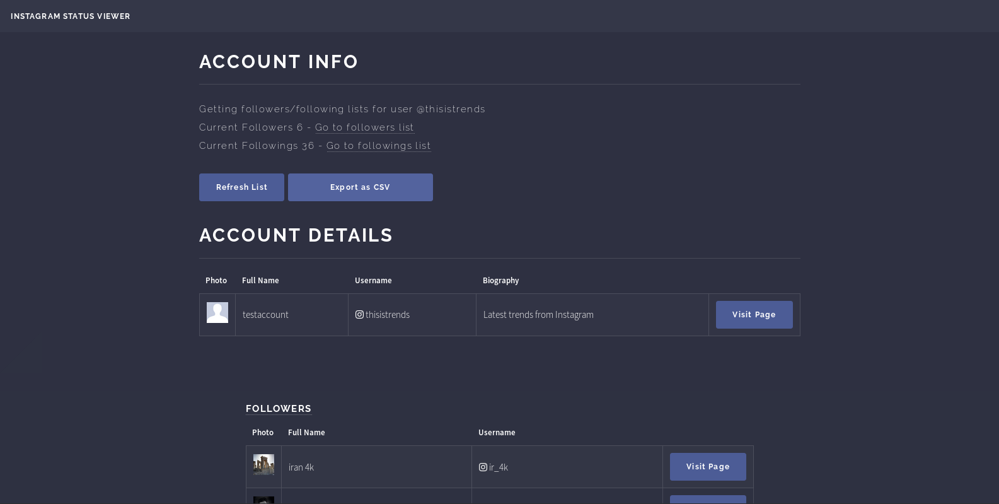

## Instagram Status Viewer

Simple Python3 script to collect your Instagram account's followers/followings in Flask. You can now unfollow users right from this panel.

### Requirements

Install the requirement packages first:

`pip3 install Flask requests requests-toolbelt`

Then simply run the code:

`python3 main.py`

Then go to http://localhost:5000 to see the result

### ToDo

- Support two-step authentication
- User should be able to follow again after unfollow

### Contributers

- [@poriyaMH](https://github.com/poriyaMH)
- [@shivai](https://github.com/shivai)

### Screenshot

